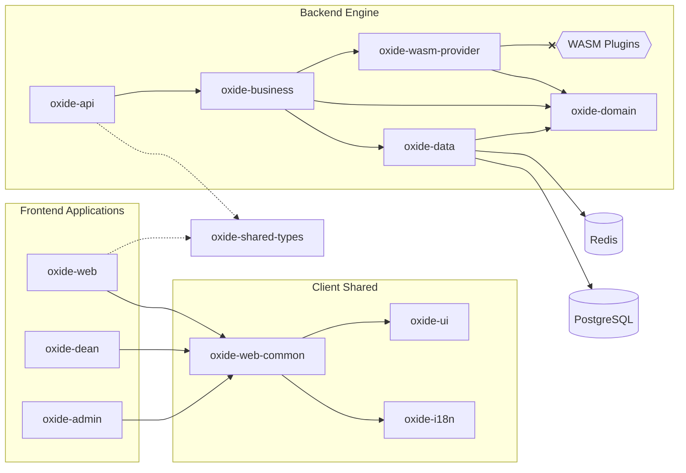
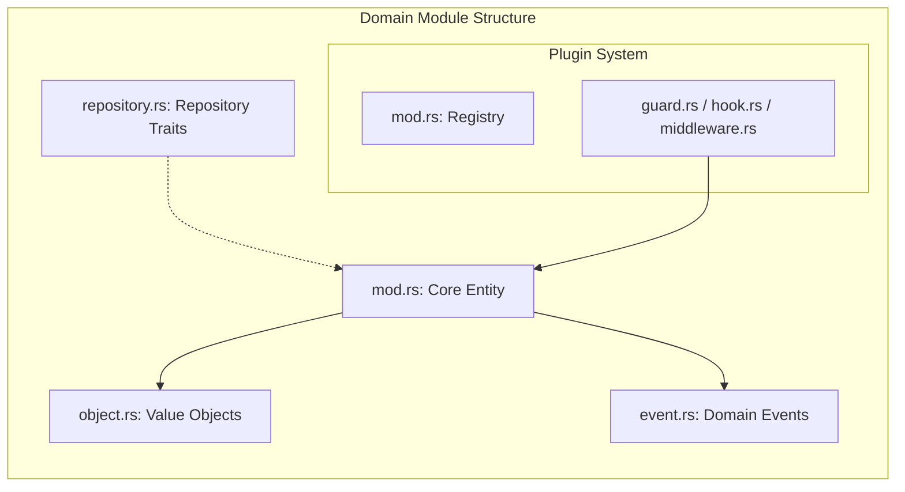
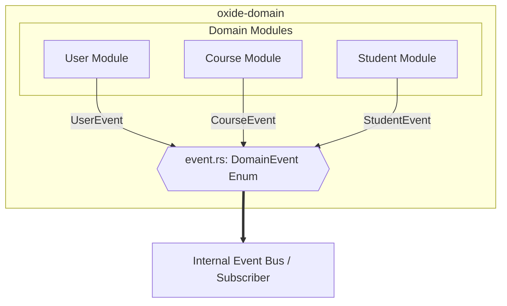

  <h1>Oxide LMS🦀</h1>
  
<b>A high-performance, modular Learning Management System powered by Rust and WebAssembly.</b>

  

    
    
    
    
    
    
  

  

    <a href="#-features">Features</a> •
    <a href="#-architecture">Architecture</a> •
    <a href="#-getting-started">Getting Started</a> •
    <a href="#-plugin-system">Plugin System</a>
  

---

## 🌟 Overview

**Oxide** is a modern alternative to legacy LMS platforms like Moodle. Built from the ground up in **Rust**, it prioritizes type safety, extreme performance, and a revolutionary plugin system based on **WebAssembly (WASM)**.

Unlike traditional systems where plugins can crash the entire server, Oxide runs extensions in an isolated, sandboxed environment using `Wasmtime`.

> [!IMPORTANT]
> This project is built using the **Rust 2024 Edition**. Ensure your toolchain is up to date (`rustup update`).

---

## ✨ Features

* **🚀 Blazing Fast:** Core engine built with `Axum` and `SQLx` for sub-millisecond response times.
* **🧩 WASM Plugins:** Extend the LMS logic (grading, custom content types) using any language that compiles to WASM.
* **💻 Modern UI:** Reactive, type-safe frontend built with `Leptos` (No JavaScript fatigue).
* **🛡️ Secure by Design:** Argon2 password hashing, AES-GCM encryption, and JWT-based authentication.
* **📖 Auto-documented API:** Full OpenAPI/Swagger support integrated via `utoipa`.

---

## 🧩 Plugin System

Oxide provides a unique "Sandboxed Extensibility" model.
- **Language Agnostic:** Write plugins in Rust, Zig, C++, or Go.
- **Hot Reloading:** Inject new logic without restarting the server.
- **Safety:** Plugins cannot access the host file system or network unless explicitly granted permission.

> [!TIP]
> See `/examples/wasm-plugin-rust` for a template on how to create a custom grading hook.

---

## 🚀 Scalability & Future-Proofing

Oxide is built as a **Modular Monolith**. This means:
* **Strong Boundaries:** Modules in `oxide-domain` do not share state.
* **Event-Driven:** Cross-module communication happens strictly through the `DomainEvent` bus.
* **Cloud Native:** The design is pre-optimized for splitting into **Microservices**. If the `course` module grows too large, it can be moved to a separate container with its own database, communicating via the existing Event System (e.g., over NATS or RabbitMQ).

---

## 🤝 Contributing

We are looking for help with:
- Implementing core domain logic.
- Improving the WASM host environment.
- Translating the UI (check `client/oxide-i18n`).

Please see [CONTRIBUTING.md](./CONTRIBUTING.md) for details.

---

## 🏗️ Architecture

Oxide uses a **Hexagonal/Clean Architecture** within a Cargo Workspace to keep the business logic separated from the infrastructure.

### 🧩 Module Anatomy
Each domain module (e.g., `course`, `user`) follows a strict internal structure to ensure separation of concerns:

### Centralized Event System 
Oxide uses a unified DomainEvent enum that aggregates events from all sub-modules. This allows for a clean, decoupled way to handle cross-module side effects (e.g., sending an email when a user is registered).

  Built with ❤️ and 🦀 by Suzdaltsev Denis

