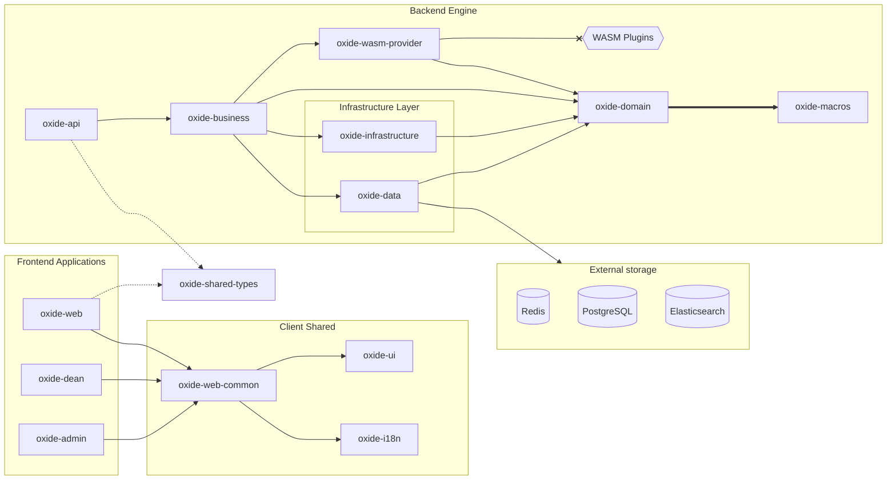
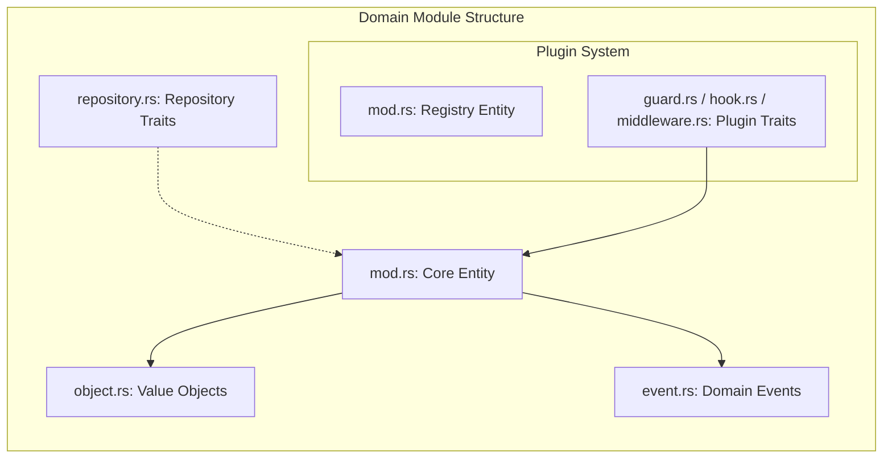
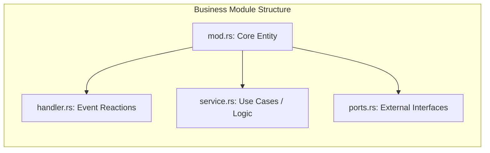
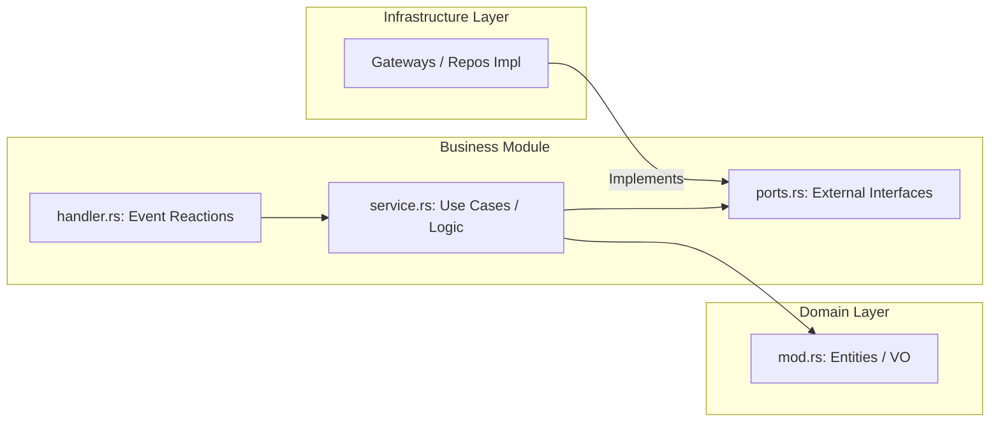

<div align="center">
  
  <h1>Oxide LMS🦀</h1>
  <p><b>A high-performance, modular Learning Management System powered by Rust and WebAssembly.</b></p>

  <p>
    
    
    
    <a href="https://crates.io/crates/leptos">
      
    </a>
    <a href="https://crates.io/crates/axum">
      
    </a>
    <a href="https://crates.io/crates/wasmtime">
      
    </a>
  </p>

  <p>
    <a href="#-features">Features</a> •
    <a href="#-architecture">Architecture</a> •
    <a href="#-getting-started">Getting Started</a> •
    <a href="#-plugin-system">Plugin System</a>
  </p>
</div>

---

## 🌟 Overview

**Oxide** is a modern alternative to legacy LMS platforms like Moodle. Built from the ground up in **Rust**, it prioritizes type safety, extreme performance, and a revolutionary plugin system based on **WebAssembly (WASM)**.

Unlike traditional systems where plugins can crash the entire server, Oxide runs extensions in an isolated, sandboxed environment using `Wasmtime`.

> [!IMPORTANT]
> This project is built using the **Rust 2024 Edition**. Ensure your toolchain is up to date (`rustup update`).

---

## ✨ Features

* **🚀 Blazing Fast:** Core engine built with `Axum` and `SQLx` for sub-millisecond response times.
* **🧩 WASM Plugins:** Extend the LMS logic (grading, custom content types) using any language that compiles to WASM.
* **💻 Modern UI:** Reactive, type-safe frontend built with `Leptos` (No JavaScript fatigue).
* **🛡️ Secure by Design:** Argon2 password hashing, AES-GCM encryption, and JWT-based authentication.
* **📖 Auto-documented API:** Full OpenAPI/Swagger support integrated via `utoipa`.

---

## 🧩 Plugin System

Oxide provides a unique "Sandboxed Extensibility" model.
- **Language Agnostic:** Write plugins in Rust, Zig, C++, or Go.
- **Hot Reloading:** Inject new logic without restarting the server.
- **Safety:** Plugins cannot access the host file system or network unless explicitly granted permission.

> [!TIP]
> See `/examples/wasm-plugin-rust` for a template on how to create a custom grading hook.

### 🔌 Plugin Contract (WIT)
Oxide uses the **WASM Component Model**. Interfaces are defined using `WIT` (WebAssembly Interface Type) files, ensuring language-independent type safety.

```wit
interface grading-provider {
    record score {
        points: f32,
        max-points: f32
    }
    calculate: func(attempt: string) -> score
}
```

---

## 🚀 Scalability & Future-Proofing

Oxide is built as a **Modular Monolith**. This means:
* **Strong Boundaries:** Modules in `oxide-domain` do not share state.
* **Event-Driven:** Cross-module communication happens strictly through the `DomainEvent` bus.
* **Cloud Native:** The design is pre-optimized for splitting into **Microservices**. If the `course` module grows too large, it can be moved to a separate container with its own database, communicating via the existing Event System (e.g., over NATS or RabbitMQ).

---

## 📂 Project Structure

<details>
<summary>Explore the Cargo Workspace</summary>

```text
.
├── client/                 # Frontend applications & web resources
│   ├── oxide-web/          # Main Student Portal (Leptos CSR/SPA)
│   ├── oxide-admin/        # System Administration dashboard for IT-staff
│   ├── oxide-dean/         # Educational management & Dean's office UI
│   ├── oxide-ui/           # Shared Design System (Components, Tailwind, Styles)
│   ├── oxide-web-common/   # Common frontend logic, API-fetchers, and hooks
│   └── oxide-i18n/         # Localization engine and translation resources
├── server/                 # Backend services & business logic
│   ├── oxide-api/          # Composition Root: Axum routes, Swagger UI, and App state
│   ├── oxide-business/     # Application layer: Use-case orchestration and Handlers
│   ├── oxide-domain/       # The Core: Pure Entities, Value Objects, and Event definitions
│   ├── oxide-infrastructure/ # Technical layer: Crypto, JWT, Mailers, and External Gateways
│   ├── oxide-data/         # Persistence layer: SQLx Repository implementations
│   ├── oxide-wasm-provider/# Plugin System: Wasmtime host and runtime isolation logic
│   └── oxide-macros/       # Procedural macros for boilerplate reduction (DTOs, etc.)
├── oxide-shared-types/     # Unified DTOs and types for Client-Server synchronization
├── migrations/             # Database schema evolution (SQLx/PostgreSQL)
├── compose.yaml            # Local development environment (DB, Redis, etc.)
└── Cargo.toml              # Workspace manifest and centralized dependency management 
```
</details>

---

## 🏗️ Architecture

Oxide uses a **Hexagonal/Clean Architecture** within a Cargo Workspace to keep the business logic separated from the infrastructure.



### 🧩 Domain Module Anatomy
Each domain module (e.g., `course`, `user`) follows a strict internal structure to ensure separation of concerns:


### Centralized Event System 
Oxide uses a unified DomainEvent enum that aggregates events from all sub-modules. This allows for a clean, decoupled way to handle cross-module side effects (e.g., sending an email when a user is registered).

### Business Module Anatomy
Each business module (e.g., `course`, `user`) follows a strict internal structure to ensure separation of concerns:


### Cross-Layer Orchestration
The Business layer acts as the central mediator between pure Domain logic and technical Infrastructure, enforcing the `Dependency Inversion` principle.


---
## 🛠️ Getting Started

### Prerequisites
* **Rust:** v1.82+ (Edition 2024)
* **Trunk:** `cargo install trunk` (for frontend)
* **SQLx CLI:** `cargo install sqlx-cli`
* **Docker:** To run PostgreSQL and Redis

### Quick Run
1. **Infrastructure:** `docker-compose up -d`
2. **Database:** `sqlx database setup`
3. **Server:** `cargo run -p oxide-api`
4. **Client:** `cd client/oxide-web && trunk serve`


---

## 🗺️ Roadmap

- [ ] **Phase 1:** Core LMS (Users, Courses, Lessons) - *In Progress*
- [ ] **Phase 2:** WASM Plugin Registry & Hot-swapping
- [ ] **Phase 3:** Mobile Client (Tauri / Leptos Native)
- [ ] **Phase 4:** Advanced Analytics & AI-assisted grading

---

## 🤝 Contributing

We are looking for help with:
- Implementing core domain logic.
- Improving the WASM host environment.
- Translating the UI (check `client/oxide-i18n`).

Please see [CONTRIBUTING.md](./CONTRIBUTING.md) for details.

<div align="center">
  Built with ❤️ and 🦀 by Suzdaltsev Denis
</div>